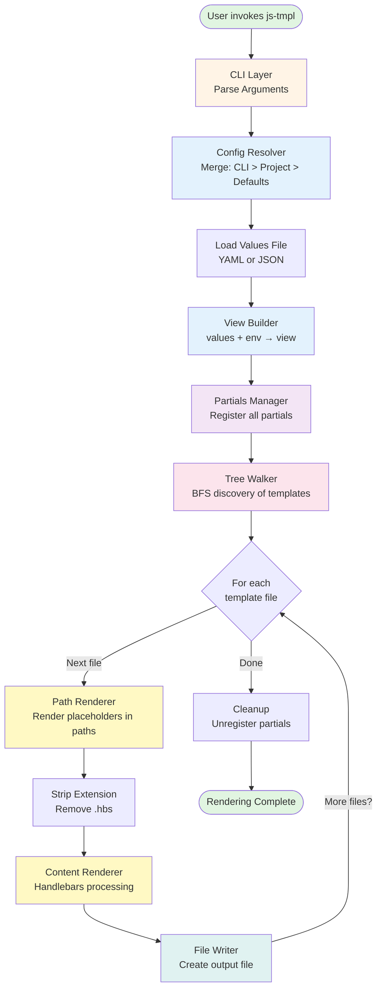
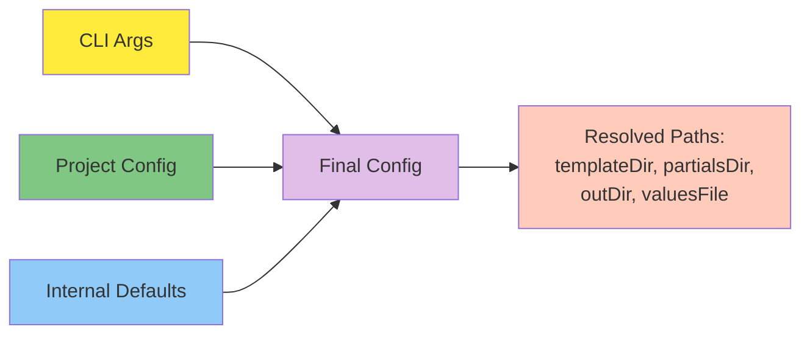
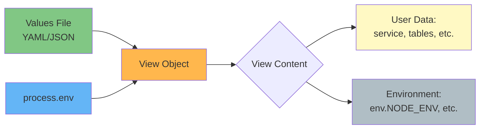
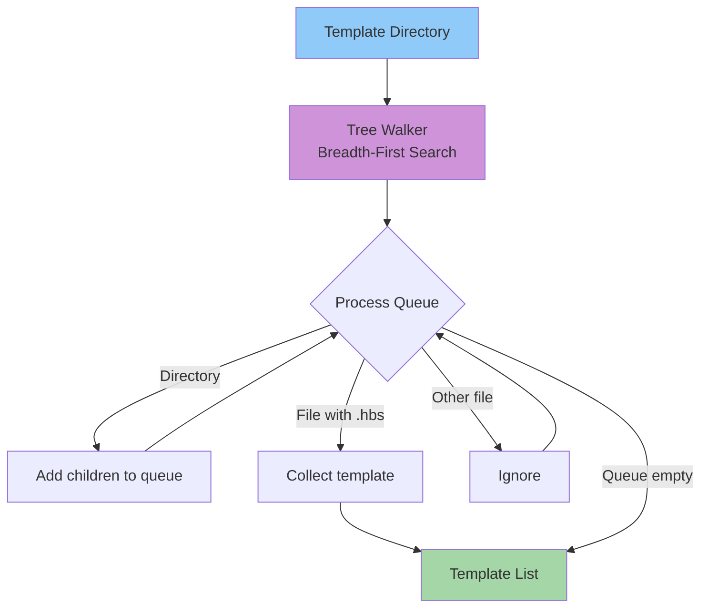
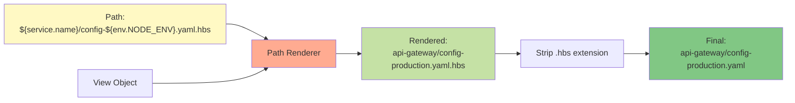
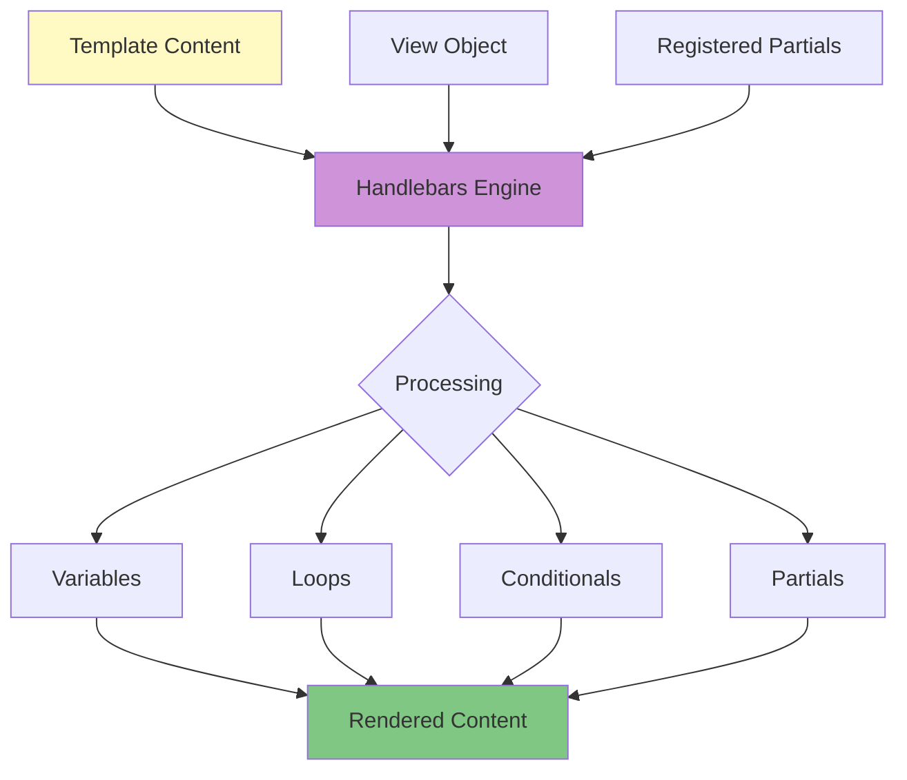
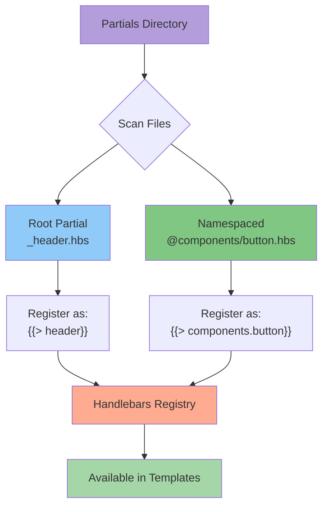
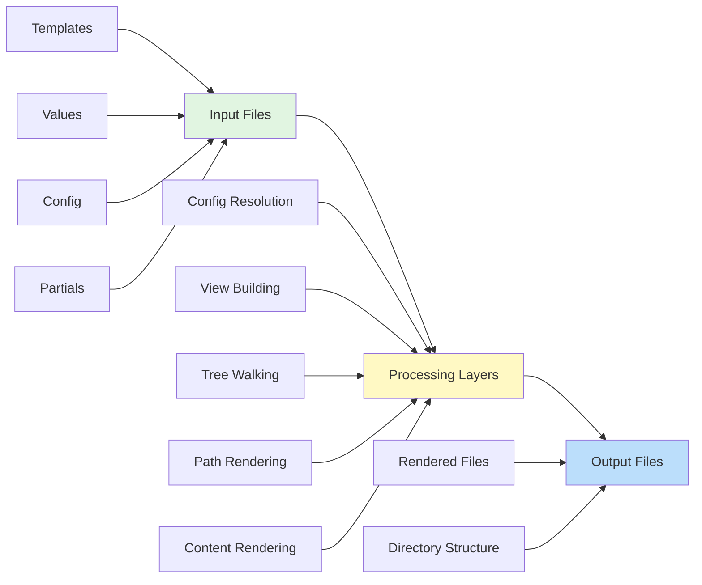
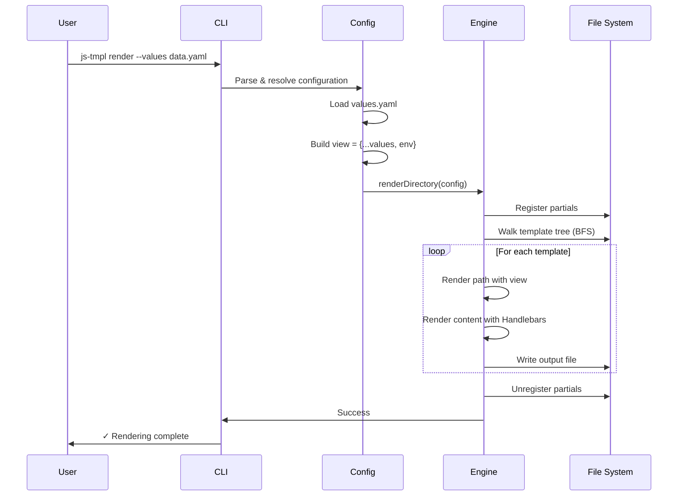

# js-tmpl Working Flow

**Version:** 0.0.1
**Last Updated:** 2026-01-20

---

## High-Level Overview

This document provides a visual guide to understanding how js-tmpl processes templates from input to output.

---

## Complete Rendering Flow

---

## Layer-by-Layer Breakdown

### 1️⃣ **Configuration Phase**

**Precedence:** CLI Args > Project Config > Internal Defaults

---

### 2️⃣ **View Building Phase**

**Result:** `view = { ...values, env: process.env }`

---

### 3️⃣ **Template Discovery Phase**

**Output:** List of `{ absPath, relPath }` for all `.hbs` files

---

### 4️⃣ **Path Rendering Phase**

**Rules:**

- `${var}` placeholders replaced with view values
- Nested access supported: `${a.b.c}`
- Missing values → empty string `""`

---

### 5️⃣ **Content Rendering Phase**

**Engine:** Handlebars with full feature support

---

### 6️⃣ **Partial System**

**Lifecycle:** Registered before rendering, unregistered after completion

---

## Data Flow Summary

---

## Key Characteristics

### 🎯 **Deterministic**

Same input → Same output, always

### 🔄 **Async & Non-Blocking**

BFS tree walking with async I/O

### 🧩 **Composable**

Each layer is independently testable and reusable

### 📦 **Isolated**

No global state pollution, partials scoped to render lifecycle

### 🚀 **Engine-First**

All operations available programmatically, not just via CLI

---

## Example End-to-End Flow

---

## Mental Model

Think of js-tmpl as a **pipeline**:

1. **Gather inputs** (config, values, templates)
2. **Build context** (view object)
3. **Discover templates** (tree walking)
4. **Transform** (path + content rendering)
5. **Write outputs** (file system)

Each step is **explicit**, **deterministic**, and **composable**.

---

## Questions This Flow Answers

- **Where does config come from?** → CLI args > project config > defaults
- **What data is available in templates?** → Everything in values file + `env`
- **How are templates discovered?** → BFS walk of `templateDir`
- **How are paths transformed?** → `${var}` rendering, then extension stripping
- **How is content rendered?** → Handlebars with registered partials
- **When are partials available?** → Registered before, unregistered after rendering

---

## See Also

- [PRINCIPLES.md](PRINCIPLES.md) - Development philosophy
- [Motivation](00-Motivation.md) - Why js-tmpl exists
