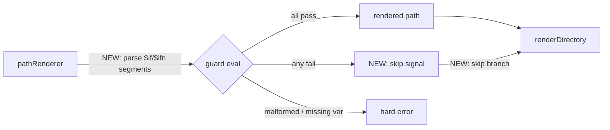
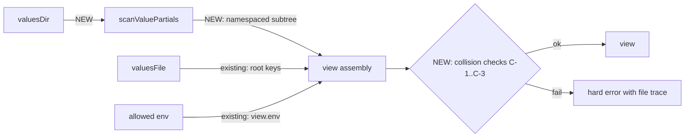

# Richer Inputs — Path Guards & Value Partials

> **Status**: Co-planning — Feature 1 semantics locked; **implementation approach mid-brainstorm** (walker-level `PathFilter[]` direction being explored). Feature 2 locked.
> **Date**: 2026-04-18 (revised 2026-04-20)
> **Revised in place**: Yes — update this doc as decisions land.
> **Companion viz**: [../workflows/render-pipeline.workflow.md](../workflows/render-pipeline.workflow.md) (diagrams only — this doc owns the design details).

---

## Why this plan exists

Two feature gaps surfaced while using js-tmpl:

1. **No way to conditionally include files based on view data.** → addressed by **Path Guards** (v0.1.0, Phase 3 extension).
2. **No way to compose `view` from multiple structured files.** → addressed by **Value Partials** (v0.1.0, Phase 2 extension — directory-as-namespace, mirroring the template partial system).

An earlier version of this plan included a third feature — explicit `ignore` patterns — but it was **deferred to 0.2.x** (see [Roadmap reconciliation](#roadmap-reconciliation) below) on the grounds that Path Guards cover most real-world skip needs in a more principled way. Neither feature is yet wired, though the render pipeline already exposes the hook points — see [../workflows/render-pipeline.workflow.md#extension-points](../workflows/render-pipeline.workflow.md#extension-points).

---

## Mental model — why these features belong

### The function (zoomed out)

```text
f(config, view, templates) → files
```

- `config` and `view` are the **user's knobs**. If the user knows both, they can predict every output file.
- `templates` is a **shared artifact** — often authored once, reused across projects.
- The engine is a **black box with a pure contract**: same inputs, same outputs, no lifecycle.

### Internal decomposition (three phases)

`f` is computed as a three-phase pipeline — this is the implementation-level view and where each feature slots in:

```text
Phase 1  cli + projectConfig + defaults            → mergedConfig
Phase 2  valuesFile + valuesDir + allowedEnv       → view
Phase 3  view + templateDir + partialsDir          → files
```

- Phases 1 and 2 live in [resolveConfig](../../../src/config/resolver.js).
- Phase 3 lives in [renderDirectory](../../../src/engine/renderDirectory.js).
- `view` is the **bridge**: a user-facing knob at the top-level; a Phase-2 product at implementation level.
- **Feature 1 (Path Guards)** extends **Phase 3** (inside `pathRenderer`). **Feature 2 (Value Partials)** extends **Phase 2** (new scan helper in `src/config/`). Neither changes the other's phase — they compose cleanly.

### Principle filter

(from [../../../docs/PRINCIPLES.md](../../../docs/PRINCIPLES.md) + [../../../AGENTS.md](../../../AGENTS.md))

| Direction                                                               | Aligned?                              |
| ----------------------------------------------------------------------- | ------------------------------------- |
| Enrich the **user's input vocabulary** (config, values)                 | ✅ lean engine, more expressive users |
| Grow **engine intelligence** (hooks, plugins, lifecycle, orchestration) | ❌ "people build that around"         |

Both features in this plan fall on the aligned side. They expand the left-hand side of `f` without touching the engine's internals. Dry-run, plugin APIs, and trace modes are **explicitly out of scope** for this plan — if we want those, they belong in user wrappers, not inside the engine.

---

## Roadmap reconciliation

[ROADMAP.md](../../../ROADMAP.md) is updated alongside this plan:

- **0.1.x (Correctness/Trust)** — adds two new line items: **Path Guards** (`$if{var}` / `$ifn{var}`) and **Value Partials** (`--values-dir`). Both fit the phase themes of "Explicit > Implicit" and "Deterministic > Clever": guards are view-driven and per-file; value partials give every value exactly one source with no merge/precedence mystery. Neither adds engine intelligence.
- **0.2.x (Scale)** — the existing "Advanced filtering and ignore rules" line is annotated with the reason it was deferred (see below). Guards cover most real-world skip needs; ignore revisits only if users hit a concrete gap guards can't express.

### Why "ignore" was deferred

Path Guards and explicit `ignore` patterns solve overlapping problems by different means:

| Approach                | Control lives in              | Skip decision is                 | Visible in                             |
| ----------------------- | ----------------------------- | -------------------------------- | -------------------------------------- |
| Path Guards (0.1.0)     | `view` + template tree layout | Per-file, driven by view data    | The template tree itself               |
| Ignore patterns (0.2.x) | Config file / CLI flag        | Per-pattern, independent of view | A config file, away from the templates |

Path Guards win for **correctness** because they keep the `f(config, view, templates) → files` promise tight: the user's config + view fully determine which files appear. Ignore patterns add a third input channel, which is fine but doesn't earn its complexity until we have evidence users need it that guards can't give them. Revisiting ignore later with real use cases in hand means we can design it **with context** instead of rushing.

---

## Feature 1 — Path Guards (decisions locked)

### Where it fits (path guards)

**Phase 3** extension — inside [pathRenderer.js](../../../src/engine/pathRenderer.js), with a skip signal propagated to [renderDirectory.js](../../../src/engine/renderDirectory.js). No change to Phases 1 or 2.

### Goal

Let a template author declare, inline in the path, whether a file should be rendered based on view data:

```text
templates/features/$if{monitoring.enabled}/dashboard.yaml.hbs
templates/envs/$if{prod}/$ifn{debug}/config.yaml.hbs
```

If any guard in the path fails, the file is not written to `dist/`.

### Why this (not ignore) for 0.1.0

- Control surface is `view` — same data the user already authors. No parallel ignore config to learn.
- Skip conditions are **visible in the template tree**, not hidden in a YAML file elsewhere.
- Composes naturally with Feature 2 (Multi-values) — layered values flip guards across environments.
- Lean engine: guards are evaluated inside the existing [pathRenderer.js](../../../src/engine/pathRenderer.js) with a small addition; no new config keys, no merge rules.

### Syntax

| Form        | Role                  | Notes                        |
| ----------- | --------------------- | ---------------------------- |
| `${var}`    | Insert value          | Existing behavior, unchanged |
| `$if{var}`  | Guard: pass if truthy | New                          |
| `$ifn{var}` | Guard: pass if falsy  | New                          |

`var` uses the same nested access (`features.monitoring.enabled`) via [getNested](../../../src/utils/object.js).

### Segment rule (whole-segment only, directories only)

A path segment that contains a guard must be **exactly** the guard — nothing else. One guard per segment. Guards appear only in **directory segments**, never in the filename.

- ✅ `templates/configs/$if{monitoring.enabled}/dashboard.yaml.hbs`
- ✅ `templates/envs/$if{prod}/$ifn{debug}/config.yaml.hbs` (two guards → two segments)
- ❌ `templates/$if{a}folder/x.hbs` → mixed segment, throw at render time
- ❌ `templates/folder/$if{a}file.hbs` → guard in filename, throw at render time
- ❌ `templates/$if{a}$if{b}/x.hbs` → two guards in one segment, throw at render time

Parse rule per segment:

1. If segment matches `^\$if(n?)\{([^}]+)\}$` → treat as guard.
2. Else if segment contains `$if{` or `$ifn{` substring anywhere → throw "guards must be whole segments, one per segment, in directory positions only".
3. Else → render `${var}` placeholders as today.

### Semantic commitments (locked)

| #   | Decision                                                                                   | Rationale                                                                                                                     |
| --- | ------------------------------------------------------------------------------------------ | ----------------------------------------------------------------------------------------------------------------------------- |
| G-1 | **Skip-file semantics**: any failing guard in the path → file not written                  | Only useful meaning; drop-segment alone reduces to a no-op                                                                    |
| G-2 | Passing guard contributes **empty string** to the path; `path.join` collapses it           | Already how [pathRenderer.js](../../../src/engine/pathRenderer.js) + `path.join` behave                                       |
| G-3 | **JS-truthy** rule: `false`, `0`, `''`, `null`, `undefined` → fail; everything else → pass | Matches Handlebars `{{#if}}`; document clearly in API docs                                                                    |
| G-4 | **Missing var throws** with segment + var name in the message                              | Guards are control flow; typos must fail loud. Accountability: if you guard on a var, specify it.                             |
| G-5 | **One guard per segment, whole segment only, directories only**                            | Parse simplicity; "don't compute too much on the path"                                                                        |
| G-6 | **No `else`, `elif`, `and`, `or`, `not`, comparisons** — ever, not just v0.1.0             | Path stays dumb. Users who need compound conditions precompute a boolean in values, or split into two files (`$if` + `$ifn`). |

### Extension point (original proposal — being revisited, see below)

What's **new** inside Phase 3 (everything else stays):



All new code is confined to [pathRenderer.js](../../../src/engine/pathRenderer.js) plus a small skip-branch in [renderDirectory.js](../../../src/engine/renderDirectory.js). The walker is untouched.

### Implementation approach — mid-brainstorm (revisit)

> ⚠️ Exploration in progress (paused 2026-04-20). Semantic commitments G-1..G-6 are unaffected; only the **where** the code lives is being reconsidered.

The original plan above evaluates guards inside pathRenderer and propagates a skip signal. A stronger alternative emerged: a walker-level `PathFilter[]` with a shared segment classifier. Key trade to revisit:

| Dimension                                            | Original (pathRenderer-returns-skip) | Alternative (walker-level PathFilter[])                                            |
| ---------------------------------------------------- | ------------------------------------ | ---------------------------------------------------------------------------------- |
| Where guard skip is decided                          | Phase 3, post-walk, in pathRenderer  | Phase 3, at walk enqueue, in filter                                                |
| Walker signature                                     | unchanged                            | grows to `(rootDir, { ext, filters })`                                             |
| Early-exit (no `stat`/`readdir` on skipped subtrees) | no                                   | yes (free when `filters = []`)                                                     |
| Home for guard-parse logic                           | pathRenderer owns it                 | shared module used by both filter + pathRenderer                                   |
| Abstraction cost                                     | none                                 | one small filter interface committed before second consumer (ignore, 0.2.x) exists |

**Tentatively agreed in exploration:**

- Walker signature changes to options-object: `walkTemplateTree(rootDir, { ext = '.hbs', filters = [] })`
- Single `ConditionalPathFilter` (handles both `$if` and `$ifn` — consolidates, one parse per segment)
- Filter signature: `apply(name, { relPath })`
- Filter return shape: `'pass' | 'skip'` + `throw` for malformed / missing-var
- Multiple filters (future) use AND semantics (any skip wins, short-circuit)
- Q-4 (filename-as-guard) is detected in pathRenderer at render time using the **same classifier** the filter uses — single source of truth for guard syntax
- Proposed module split (sketched but not locked):
  - `src/engine/pathSegment.js` — pure string logic: regex constants, `classifySegment(segment) → SegmentKind` tagged union (`literal | interpolation | if-guard | ifn-guard | malformed`)
  - `src/engine/pathFilters.js` — view-coupled: `makeConditionalPathFilter(view)` + `evalGuard(segment, view)` using `classifySegment`
  - `pathRenderer.js` imports `classifySegment` for segment dispatch + filename-guard check
  - `treeWalker.js` gains `filters` param; wraps filter errors with `relPath` context
  - `renderDirectory.js` constructs `[makeConditionalPathFilter(cfg.view)]` from config

**Still open (blockers before committing to this approach):**

- **Q-A** — one module (`pathSegment.js` holds classifier + eval + factory) or split into two (`pathSegment.js` pure + `pathFilters.js` view-coupled)? Lean: two.
- **Q-B** — `evalGuard` location — in `pathSegment.js` (even though view-coupled) or `pathFilters.js` (consistent with "pure vs coupled" split)? Lean: `pathFilters.js`.
- **YAGNI tension** — introducing `PathFilter[]` commits us to an interface before the second consumer (ignore, 0.2.x) exists. Rule-of-three says wait; the counter-argument is that walker-level filters have _negative_ cost (zero overhead when empty, less fs work when non-empty). Needs a clear call before commit.
- **Churn** — we just removed `ignore[]` from the walker as dead code; re-adding `filters[]` in the same release is not semantically the same, but git log will look noisy. Manageable with a CHANGELOG note, but worth naming.

**What happens if this approach lands:** the phase breakdown below reshuffles (6 phases instead of 5, starting with the new `pathSegment.js` module). The original 5-phase breakdown remains valid for the pathRenderer-returns-skip approach.

**Concrete code sketches** captured in the conversation on 2026-04-20 — retrieve from session history when resuming. Not pasted here to keep this doc lean.

### Proposed phases (original approach — supersede if walker-level filters land)

- **Phase 1** — Extend [pathRenderer.js](../../../src/engine/pathRenderer.js): recognize `$if{...}` / `$ifn{...}` whole-segment guards; return a `{ path, skip }` result (or a dedicated sentinel). Throw for malformed segments and missing guard vars. Pure-function unit tests: all pass, one fails, mixed segments, filename guards, missing vars, JS-truthy edge cases (`0`, `''`, `null`).
- **Phase 2** — Wire skip signal through [renderDirectory.js](../../../src/engine/renderDirectory.js): when a path returns skip, do not call `renderContent` / `writeFileSafe` for that file. Integration test: template tree with guards produces expected `dist/` tree across multiple views.
- **Phase 3** — Error messages: every throw path includes the offending template's `relPath` and the variable name. Snapshot tests on error strings.
- **Phase 4** — Docs: new section in [docs/API.md](../../../docs/API.md) (syntax, semantics, examples, JS-truthy note, missing-var-throws note); a short paragraph in [README.md](../../../README.md) Quick Start; update [docs/agents/workflows/render-pipeline.workflow.md](../workflows/render-pipeline.workflow.md) Pipeline Stages entry for path rendering.
- **Phase 5** — Example under [examples/](../../../examples/) demonstrating guards across two environments (dev vs prod), composing naturally with a single values file (and later, when Feature 2 lands, with layered values).

### Proposed phases (alternative approach — walker-level PathFilter[])

- **Phase 1** — `src/engine/pathSegment.js`: regex constants + `classifySegment()` tagged-union classifier. Pure unit tests for all 5 kinds, malformed cases, edge cases (`0`, `''`, `null` — these matter at the eval layer, not classifier).
- **Phase 2** — `src/engine/pathFilters.js`: `evalGuard()` + `makeConditionalPathFilter(view)` factory. Builds on Phase 1. Tests cover missing-var throws, JS-truthy, negation.
- **Phase 3** — [treeWalker.js](../../../src/engine/treeWalker.js): options-object refactor + `filters` param + filter-error wrapping with `relPath` context. Tests for `filters = []` parity, filter-skip-subtree, error propagation.
- **Phase 4** — [pathRenderer.js](../../../src/engine/pathRenderer.js): use `classifySegment` for segment dispatch; add filename-guard detection + throw. Existing tests pass; new tests for guard-segment collapse + filename-guard rejection.
- **Phase 5** — [renderDirectory.js](../../../src/engine/renderDirectory.js): construct filter from `cfg.view`, pass to walker. Integration test: guards across two environments.
- **Phase 6** — Docs + example (same scope as Phase 4+5 of the original approach above).

**Gate for each phase (either approach)**: `pnpm test` green + coverage ≥ 99%.

### Session-side cleanup already executed (not a phase)

As part of this brainstorm, the dormant `ignore = []` param was **removed** from [treeWalker.js](../../../src/engine/treeWalker.js) along with 4 related tests. Rationale: dead code (zero callers, not in public API), and when 0.2.x ignore lands it will be designed with concrete context (possibly `PathFilter[]`, possibly different). Keeping this note so the change reads intentionally, not accidentally, in git log. The walker is currently `walkTemplateTree(rootDir, ext = '.hbs')` — clean slate for whichever approach above wins.

---

## Feature 2 — Value Partials (decisions locked)

### Where it fits (value partials)

**Phase 2** extension — a new `scanValuePartials()` helper under `src/config/`, integrated into [resolveConfig](../../../src/config/resolver.js). Phase 3 consumes the richer `view` exactly as before. This is what "enrich the left-hand side of `f` without touching the engine" looks like concretely.

### Goal (value partials)

Let users compose `view` from multiple files without merge semantics. Directory layout becomes namespace, exactly mirroring the template partial system at [src/engine/partials.js](../../../src/engine/partials.js):

```text
app.yaml                          → --values app.yaml              → view.project.*, view.config.*
values-partials/
  env/prod.yaml                   → --values-dir values-partials   → view.env.prod.*
  services/api.yaml                                                 → view.services.api.*
  @shared/constants.yaml          (deferred — see "not in scope")   → (future) view.*
```

Templates access everything through the resulting `view` object: `{{project.name}}`, `{{env.prod.replicas}}`, `{{services.api.port}}`.

### Why partial-analogue (not merge)

Merge-based layering (Helm/Ansible style) trades predictability for ergonomics. Every layered-config user eventually loses time to "which layer won this key?" debugging. Value Partials pick the other side: every value has **exactly one source**, visible in the file tree, and the template **names the source**. Predictability isn't documented — it's structural. This matches the ethos already in [README.md:239](../../../README.md#L239) ("fail loudly over guess silently") and [README.md:63](../../../README.md#L63) ("explicit over implicit").

### Syntax (value partials) — CLI + config

CLI (mirrors `-p, --partials-dir`):

```text
-c, --values FILE         Values file (YAML/JSON) — contents become root view
--values-dir DIR          Value partials directory — namespaced into view by path
```

Config keys:

```yaml
valuesFile: app.yaml
valuesDir: values-partials # repurposed — see "breaking change" below
```

### Semantic commitments (value partials, locked)

| #    | Decision                                                                                                          | Rationale                                                                                  |
| ---- | ----------------------------------------------------------------------------------------------------------------- | ------------------------------------------------------------------------------------------ |
| VP-1 | **Namespace by path** — `env/prod.yaml` → `view.env.prod.*`. Segments separated by `.`.                           | Mirrors [partials.js:42](../../../src/engine/partials.js#L42) exactly.                     |
| VP-2 | **Segment validation** — each segment must match `/^\w+$/`.                                                       | Reuse [partials.js:4](../../../src/engine/partials.js#L4). Identical rule, no new surface. |
| VP-3 | **Duplicate-throws** — two paths resolving to the same namespace → hard error naming both files.                  | Mirror [partials.js:69](../../../src/engine/partials.js#L69).                              |
| VP-4 | **No merge, no precedence** — each value has one source; duplicates are an error, not a cascade.                  | The whole point.                                                                           |
| VP-5 | **Single file stays flat** — `--values app.yaml` alone loads into root view (today's behavior, unchanged).        | Back-compat + simple Quick Start.                                                          |
| VP-6 | **`valuesDir` is optional** — skipped if absent, same as [partials.js:105](../../../src/engine/partials.js#L105). | Users opt into the scale path.                                                             |
| VP-7 | **`@` flatten escape — deferred** to a later version; not in 0.1.0.                                               | YAGNI. Step 3 of the partial evolution arc; add only if real demand emerges.               |

### Overlap & collision rules (three cases, all hard errors)

| #   | Case                                                                                        | Detection                   | Error message (shape)                                                                          |
| --- | ------------------------------------------------------------------------------------------- | --------------------------- | ---------------------------------------------------------------------------------------------- |
| C-1 | `valuesFile` path is inside `valuesDir`                                                     | Phase 1 (config resolution) | "`valuesFile` 'X' is inside `valuesDir` 'Y'. Move the file out, or drop `valuesDir`."          |
| C-2 | Top-level key in `valuesFile` collides with a top-level namespace scanned from `valuesDir`  | Phase 2 (view build)        | "Duplicate view key 'K' — registered by both: `valuesFile` top-level key, `valuesDir/K.yaml`." |
| C-3 | `valuesDir` produces a top-level namespace named `env` (reserved for environment variables) | Phase 2 (view build)        | "Value partial '{path}' conflicts with reserved 'env' namespace."                              |

All three fail at load, before any rendering. No silent resolution.

### Extension point (value partials)

What's **new** inside Phase 2 (everything else stays):



All new code is confined to Phase 2: a `scanValuePartials(valuesDir, ext)` helper in `src/config/` (mirroring `scanPartialFiles` from [partials.js:53](../../../src/engine/partials.js#L53)) plus the three collision checks. Phase 3 is untouched.

### Breaking change

Today's `valuesDir` is a **base-path helper** for resolving `valuesFile` ([resolver.js:15](../../../src/config/resolver.js#L15)). Under this plan it becomes the **value partials root**. This is a semantic break:

- **What breaks**: existing users who rely on `valuesDir: foo` + `valuesFile: app.yaml` to resolve to `foo/app.yaml` must instead write `valuesFile: foo/app.yaml`.
- **Why acceptable**: project is at `v0.0.1`; no CLI flag today; no examples use it; migration is a path-string rewrite in one config key.
- **Documented in**: CHANGELOG at ship time, plus a short "migration" note in the release PR.

### Proposed phases (value partials)

- **Phase 1** — Introduce `scanValuePartials(valuesDir, ext)` as a pure helper under `src/config/` (likely `valuePartials.js`). Port segment validation + duplicate detection from [partials.js](../../../src/engine/partials.js). Unit tests: nested, flat, invalid segment, duplicate, `env` collision, empty dir, missing dir.
- **Phase 2** — Retire current `valuesDir` base-path behavior. Rewrite [resolver.js](../../../src/config/resolver.js): `valuesDir` now passes to `scanValuePartials`; `valuesFile` is resolved from cwd (no implicit base-path). Update [defaults.js](../../../src/config/defaults.js) comments, [types.js](../../../src/types.js) types.
- **Phase 3** — Integrate into view build: `buildView(rootValues, env, namespaces)`. Implement collision checks C-1, C-2, C-3. Integration tests: one file, dir-only, both, each collision case.
- **Phase 4** — CLI: add `--values-dir DIR` flag alongside existing `--values` in [src/cli/args.js](../../../src/cli/args.js) and usage in [src/cli/usage.js](../../../src/cli/usage.js).
- **Phase 5** — Docs: update [README.md](../../../README.md) CLI table, Quick Start "scale" variant, [docs/API.md](../../../docs/API.md) config schema, migration note. Update [docs/agents/workflows/render-pipeline.workflow.md](../workflows/render-pipeline.workflow.md) with three-phase model.
- **Phase 6** — New example `examples/value-partials/` showing a tree with two environments (`env/dev`, `env/prod`) and a shared root `app.yaml`.
- **Phase 7** — Migration-focused tests: the old `valuesDir = foo + valuesFile = app.yaml` shape should produce a clear error pointing users to the new rule.

**Gate for each phase**: `pnpm test` green + coverage ≥ 99%.

---

## What's rejected (and why — for the record)

- **Plugin / hook system** — violates "no lifecycle, no side effects" in [PRINCIPLES.md](../../../docs/PRINCIPLES.md). If users need mid-pipeline intervention, they compose around `resolveConfig` + `renderDirectory` (already separately exported).
- **Ignore patterns in 0.1.0** — deferred to 0.2.x; Path Guards cover most real-world skip needs more principled. Revisit only with concrete user evidence.
- **Default ignore list** (e.g. auto-ignore `.git`, `node_modules`) — violates "Explicit over Implicit" in [README.md:63](../../../README.md#L63).
- **`else` / `elif` / `and` / `or` / `not` / comparisons in guards** — not v0.1.0, not ever. Path rendering stays dumb. Compound logic goes in values (precomputed boolean) or into two files (`$if` + `$ifn` pair). Principle: "don't compute too much on the path — if you really need that, use filter/ignore or build around the engine."
- **Guards in filenames or mixed with literals in a segment** — parse ambiguity, user surprise, no real-world need. Whole-segment-only, directories-only.
- **Merge-based multi-values** (layered files with precedence, Helm/Ansible-style) — trades predictability for ergonomics. Replaced by Value Partials (namespaced, no merge). Users who want override cascades either pre-merge externally (`yq eval-all`) or, once helpers ship, use a `{{coalesce a b c}}` helper in templates. [README.md:239](../../../README.md#L239) explicitly refused this tradeoff.
- **`@` flatten escape for value partials** — deferred to a later version, not rejected outright. Add only when concrete demand emerges. YAGNI for 0.1.0.
- **Preserving old `valuesDir` base-path behavior** — the repurposing of `valuesDir` to mean "value partials root" is a semantic break, acceptable pre-1.0; costs ~4 tests + ~6 doc sections to migrate, all in one commit.

---

## Execution handoff

When a feature's decisions land and you green-light execution:

1. The corresponding section above becomes the input to **master-plan** skill.
2. A `Round_02.md` (and/or `Round_03.md`) is written under [.agents/plan/cycles/](../../../.agents/plan/cycles/) in the PDCA format (see [Round_01.md](../../../.agents/plan/cycles/Round_01.md)).
3. This plan doc is updated in place: check off the feature and link to the round.
4. Phases commit one-by-one behind their acceptance gates.

Until decisions land, **no code changes** — this is a thinking artifact.

---

## Decision log

### Feature 1 — Path Guards: semantics ✅ locked; implementation ⏸ paused

**Semantic commitments (locked — do not revisit without cause):**

| #      | Decision                                                       |
| ------ | -------------------------------------------------------------- |
| Syntax | `$if{var}` / `$ifn{var}`, whole-segment, directories only      |
| G-1    | Skip-file semantics                                            |
| G-2    | Passing guard collapses to empty segment                       |
| G-3    | JS-truthy                                                      |
| G-4    | Missing var throws                                             |
| G-5    | One guard per segment, whole segment, directories only         |
| G-6    | No `else` / `elif` / `and` / `or` / `not` / comparisons — ever |

**Implementation approach (paused 2026-04-20):**

Two candidates on the table — see "Implementation approach — mid-brainstorm" in the Feature 1 section:

- (A) pathRenderer-returns-skip (original, walker untouched)
- (B) walker-level `PathFilter[]` + shared `classifySegment` module (newer, early-exit)

Open: Q-A (module split), Q-B (`evalGuard` location), YAGNI call on committing `PathFilter[]` interface before 0.2.x ignore arrives.

Not ready for Round_02 until (A) vs (B) is chosen.

### Feature 2 — Value Partials: ✅ locked

Earlier iterations of this plan explored a merge-based multi-values design (layered files with precedence rules). That was **rejected** after observing that Helm/Ansible-style merges trade predictability for ergonomics — exactly the trade js-tmpl has already refused in [README.md:239](../../../README.md#L239) and [README.md:63](../../../README.md#L63). The partial-analogue design (below) replaced it.

| #        | Decision                                                                                                         |
| -------- | ---------------------------------------------------------------------------------------------------------------- |
| Model    | Directory-as-namespace, mirroring template partials at [src/engine/partials.js](../../../src/engine/partials.js) |
| CLI      | `--values-dir DIR` (new, mirrors `-p, --partials-dir`)                                                           |
| VP-1     | Namespace by path: `env/prod.yaml` → `view.env.prod.*`                                                           |
| VP-2     | Segment validation: `/^\w+$/` per segment                                                                        |
| VP-3     | Duplicate-throws with both paths named                                                                           |
| VP-4     | No merge, no precedence — each value has one source                                                              |
| VP-5     | Single `--values FILE` stays flat into root (unchanged)                                                          |
| VP-6     | `valuesDir` is optional, skipped if absent                                                                       |
| VP-7     | `@` flatten escape — deferred; not in 0.1.0                                                                      |
| C-1      | Overlap: `valuesFile` inside `valuesDir` → hard error at Phase 1                                                 |
| C-2      | Root-vs-namespace key collision → hard error at Phase 2                                                          |
| C-3      | Reserved `env` namespace collision → hard error at Phase 2                                                       |
| Breaking | Existing `valuesDir` base-path behavior retires (pre-1.0, documented in CHANGELOG + migration note)              |

Ready for Round_03 when green-lit.
