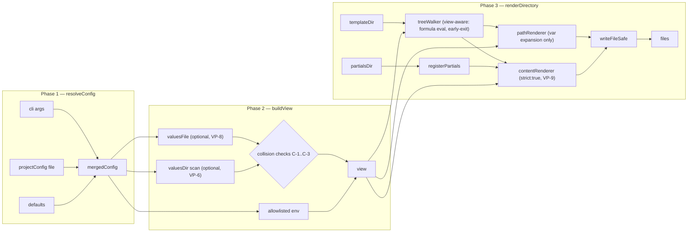
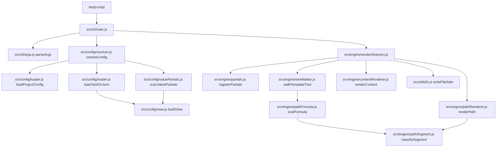
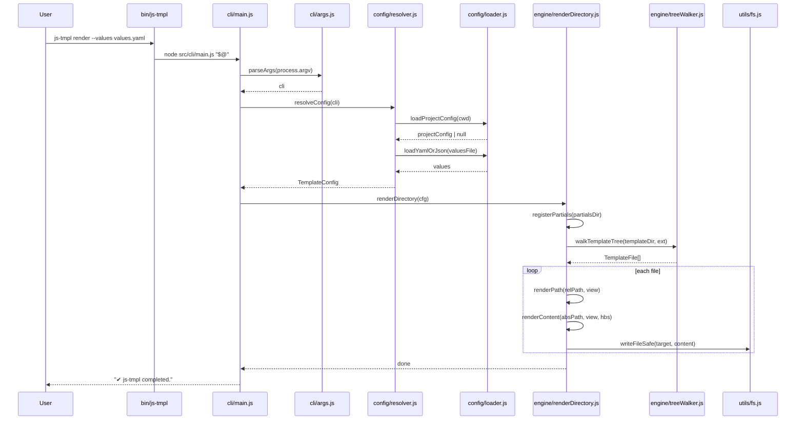

# Render Pipeline — Visualization

> Diagrams of how `js-tmpl render` transforms inputs into files.
>
> - Conceptual model: [README.md#mental-model](../../../README.md#mental-model)
> - Design principles: [docs/PRINCIPLES.md](../../../docs/PRINCIPLES.md)
> - Proposed extensions: [../plan/20260418-richer-inputs.plan.md](../plan/20260418-richer-inputs.plan.md)
>
> This doc exists to **show** the system. It does not re-explain concepts
> owned by README, API docs, or the plan doc.

---

## Three-phase data flow

---

## Component view

---

## Sequence — `js-tmpl render --values values.yaml`

---

## References

- [README.md](../../../README.md) — user-facing overview and mental model
- [docs/API.md](../../../docs/API.md) — programmatic API
- [docs/PRINCIPLES.md](../../../docs/PRINCIPLES.md) — design principles
- [ROADMAP.md](../../../ROADMAP.md) — planned features
- [src/types.js](../../../src/types.js) — type shapes (JSDoc)
- [../plan/20260418-richer-inputs.plan.md](../plan/20260418-richer-inputs.plan.md) — proposed 0.1.0 features with design details
